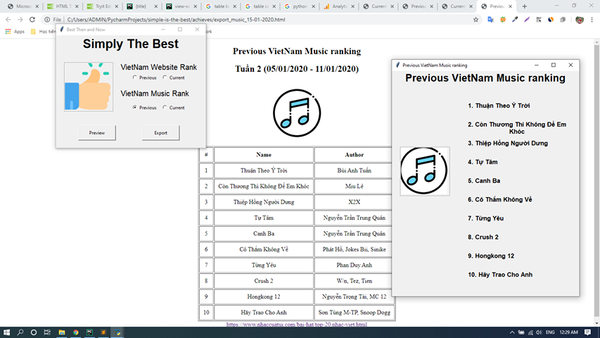
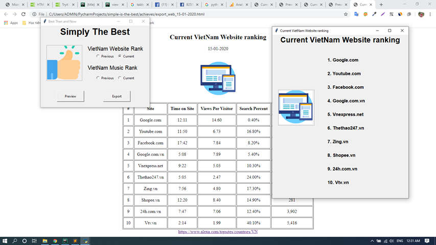

## Hướng dẫn cài đặt
- Video hướng dẫn
> https://youtu.be/xXBxQuCBLhA
- Cài đặt Python và Pycharm IDE
> https://www.youtube.com/watch?v=AYTUQT8eyYY
- Tiếp tục thực hiện bước **Chạy project** ở phía dưới
## Cài đặt Tkinter trên Windows

Kéo xuống phần Windows
> https://tkdocs.com/tutorial/install.html

Hoặc lấy file cài có sẵn trong thư mục setup nhé. Cài bình thường như ứng dụng khác thôi.

## Chạy project

B1. Thay đổi ABS_PATH trong file `the_best.py` nhé

`ABS_PATH` là đường dẫn tuyệt đối tới thư mục chứa project. Ví dụ: của mình là 

```buildoutcfg
C:\Users\ADMIN\PycharmProjects\simple-is-the-best\

Thì
ABS_PATH = r'file:\\C:\Users\ADMIN\PycharmProjects\simple-is-the-best\{}'

# lưu ý có r'file:\\ ở đầu và {} ở cuối nha.
```

B2. Chạy project

## Ảnh màn hình
- Music rank

- Website rank
